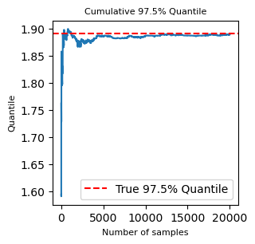
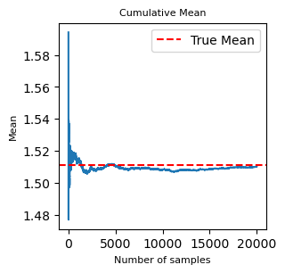
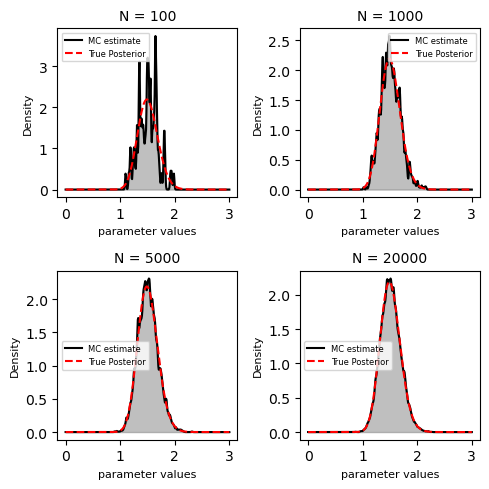

# Bayesian Posterior Approximation with Monte Carlo

This project demonstrates **Bayesian inference** for a Poisson–Gamma model using **Monte Carlo sampling** and **Metropolis–Hastings MCMC**.

## Description

The code:
- Defines a Gamma posterior distribution
- Draws Monte Carlo samples from the posterior
- Approximates the density using kernel density estimation (KDE)
- Computes a 95% credible interval
- Runs a Metropolis–Hastings MCMC sampler
- Illustrates convergence and the effect of sample size

## Output

The script produces plots comparing:
- True posterior vs Monte Carlo estimate
- MCMC trace plot

  
- Convergence of mean and quantiles
  
- Monte Carlo approximations for different sample sizes
  
  

## Requirements

- Python 3
- NumPy
- SciPy
- Matplotlib

